<a name="readme-top"></a>
<div align="center">

  <h1>Ecommerce Dashboard</h1>
  
  <p>
    This is a comprehensive and fully functional Ecommerce Dashboard built with **React**, **TailwindCSS**, and **Syncfusion**. It offers a seamless user experience with a modern design, responsive layout, and interactive features for managing ecommerce data effectively.
  </p>

<!-- Badges -->
<p>
  <a href="https://github.com/muhammadzubairbaig/ecommerce-dashboard/graphs/contributors">
    
  </a>
  <a href="">
    
  </a>
  <a href="https://github.com/muhammadzubairbaig/ecommerce-dashboard/network/members">
    
  </a>
  <a href="https://github.com/muhammadzubairbaig/ecommerce-dashboard/stargazers">
    
  </a>
  <a href="https://github.com/muhammadzubairbaig/ecommerce-dashboard/issues/">
    
  </a>
  <a href="https://github.com/muhammadzubairbaig/ecommerce-dashboard/blob/master/LICENSE">
    
  </a>
</p>

<h4>
    <a href="https://primedashboard.netlify.app/">View Website</a>
  <span> · </span>
    <a href="https://github.com/muhammadzubairbaig/ecommerce-dashboard">Documentation</a>
  <span> · </span>
    <a href="https://github.com/muhammadzubairbaig/ecommerce-dashboard/issues/">Report Bug</a>
  <span> · </span>
    <a href="https://github.com/muhammadzubairbaig/ecommerce-dashboard/issues/">Request Feature</a>
</h4>
</div>

---

## Table of Contents
- [About the Project](#about-the-project)
- [Dependencies Overview](#dependencies-overview)
- [Features](#features)
- [Folder Structure](#folder-structure)
- [Tech Stack](#tech-stack)
- [Getting Started](#getting-started)
  - [Installation](#installation)
- [Media](#media)
- [Contribution Guidelines](#contribution-guidelines)
- [Contact](#contact)
- [Acknowledgements](#acknowledgements)

---

## About the Project

<p align="center"> 
  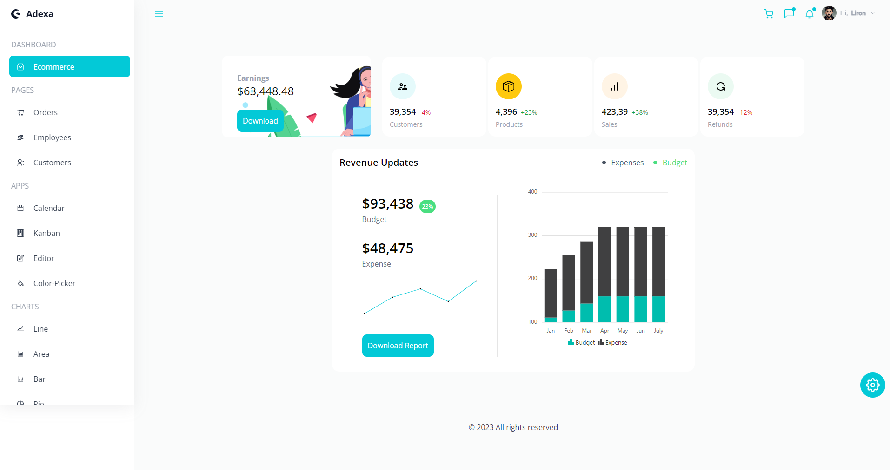
  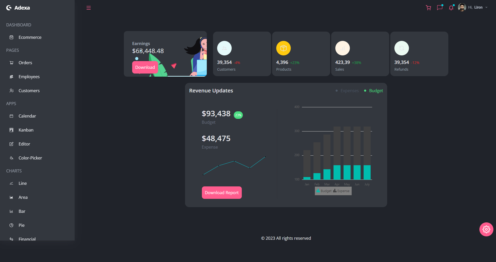
</p>

This Ecommerce Dashboard provides an outstanding fully responsive user interface using TailwindCSS with functionality powered by Syncfusion, a world-class UI Component Suite.

---

## Dependencies Overview

### Full Dependencies
```json
"dependencies": {
  "@syncfusion/ej2-react-calendars": "^19.4.48",
  "@syncfusion/ej2-react-charts": "^19.4.50",
  "@syncfusion/ej2-react-dropdowns": "^19.4.52",
  "@syncfusion/ej2-react-grids": "^19.4.50",
  "@syncfusion/ej2-react-inputs": "^19.4.52",
  "@syncfusion/ej2-react-kanban": "^19.4.48",
  "@syncfusion/ej2-react-popups": "^19.4.52",
  "@syncfusion/ej2-react-richtexteditor": "^19.4.50",
  "@syncfusion/ej2-react-schedule": "^19.4.50",
  "react": "^17.0.2",
  "react-dom": "^17.0.2",
  "react-icons": "^4.3.1",
  "react-router-dom": "^6.22.1",
  "react-scripts": "5.0.1"
}


  ### Dev Dependencies
  ```bash
  "devDependencies": {
  "autoprefixer": "^10.4.2",
  "postcss": "^8.4.6",
  "tailwindcss": "^3.0.19"
}

  ```

## Features

### **Core Features**
- **Responsive Dashboard**: A fully responsive layout optimized for different devices and screen sizes.
- **Dynamic Theme Switching**: Supports light and dark modes with custom color options.
- **Interactive Data Visualization**: Includes charts like Line, Area, Pie, Bar, Financial, and more.
- **Functional Applications**:
  - **Calendar**: A fully functional event management system.
  - **Kanban Board**: Task and project management.
  - **WYSIWYG Editor**: A rich text editor for creating and formatting content.
  - **Color Picker**: Select and manage colors for themes or design.

### **Data Management**
- **Ecommerce Data Tracking**: Manage orders, employees, and customer data in real-time.
- **Revenue Updates**: Display budget and expense tracking with charts.
- **Order Management**: Track order statuses and customer interactions.

### **Advanced Charts**
- **Custom Charts**: Built with Syncfusion library, including:
  - Line, Area, Bar, Pie, Pyramid, and Stacked Charts.
  - Color Mapping and Financial Charts for data analysis.
<!-- Folder Structure -->
### Folder Structure

<b>Ecommerce Dashboard</b> code folder structure
```
Ecommerce-Dashboard/
|- src
  |-- components/
    |-- Charts/
  |-- contexts/
  |-- data/
  |-- pages/
    |-- Charts/
  |-- App.js
```

Now, lets dive into src folder.

### components

`Button.jsx` - `Cart.jsx` - `ChartsHeader.jsx` - `Chat.jsx` - `Footer.jsx` - `Header.jsx` - `Navbar.jsx` - `Notification.jsx` - `Sidebar.jsx` - `ThemeSettings.jsx` - `UserProfile` - `index.js`

This folder contains all the function components, which they're independent and reusable bits of code. They serve the UI (User Interface) of dashboard to avoid unnecessary repetition of the code.
those components are beautiful customized widgets using TailwindCSS to describe initial theme for widgets as they're named.

#### Charts

`LineChart.jsx` - `Pie.jsx` - `SparkLine.jsx` - `Stacked.jsx`

This sub-folder contains implementation of customized Charts Components using Syncfusion library

### contexts

This folder contains `ContextProvider.jsx` which implement Adanced State Management of the entire application using React Context API.

### data

This folder contains media of the application and a data file names `dummy.js` for the various data of the application, including contents, elments, theme, icons, information for charts, etc.

### pages

`Calendar.jsx` - `ColorPicker.jsx` - `Customers.jsx` - `Ecommerce.jsx` - `Editor.jsx` - `Employees.jsx` - `Kanban.jsx` - `Orders.jsx` - `index.jsx`

this folder contains activities / scenes of application as a exported react arrow function components.
this folder contains a well-structured activities / scenes of applications using advanced React Best Practices.
Ecommerce Dashboard includes Dashboard, 3 Pages, 4 Apps and 8 fully functional charts! 
among these, you can find a fully functional Calendar, a Kanban Board, a WYSIWYG Editor and a Color Picker Apps.

#### Charts

`Area.jsx` - `ColorMapping.jsx` - `Bar.jsx` - `Financial.jsx` - `Line.jsx` - `Pie.jsx` - `Pyramid.jsx` - `Stacked.jsx`

This sub-folder contains implementation of customized Charts pages using Syncfusion library. There're eigth different types of charts: Line, Area, Bar, Pie, Financial, Color-Mapping, Pyramid and Stacked using Syncfusion library.


<!-- TechStack -->
### Tech Stack

- **React**: A JavaScript library for building user interfaces 
- **React Router**: Declarative routing for React applications.
- **TailwindCSS**: A utility-first CSS framework for styling.
- **Syncfusion**: UI components for creating charts, grids, and data visualization.


<!-- Getting Started -->
##   Getting Started

<!-- Installation -->
###  Installation

#### Step 1:
Download or clone this repo by using the link below:

```bash
git clone https://github.com/muhammadzubairbaig/ecommerce-react
```

#### Step 2:

This project is using NPM (Node Package Manager), therefore, make sure that Node.js is installed by execute the following command in consle

```bash
  node -v
```

### Step 3:

Go to root folder and execute the following command to get the required packages:

```bash
  npm install
```

### Step 4:

At the root folder execute the following command in order to start the app:

```bash
  npm start
```

<!-- Media -->
##  Media

### PAGES
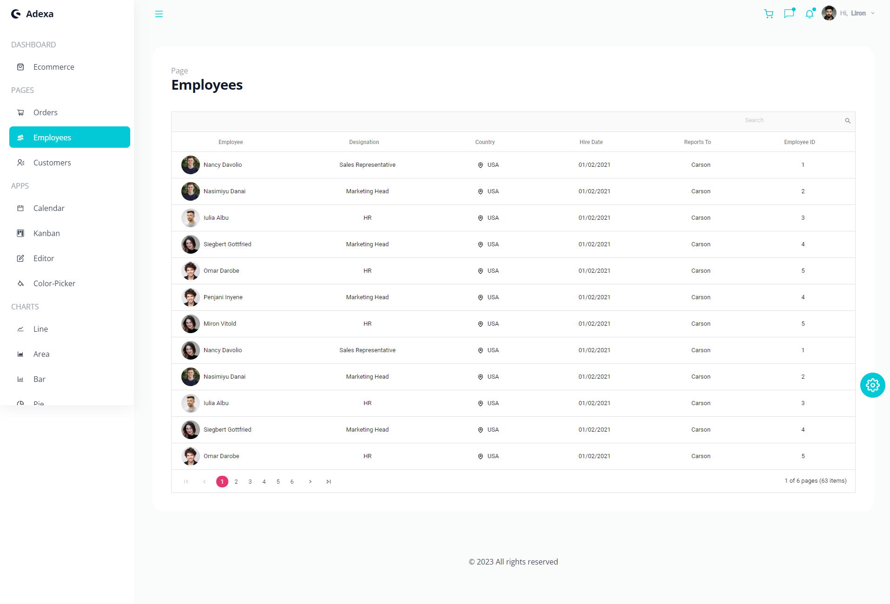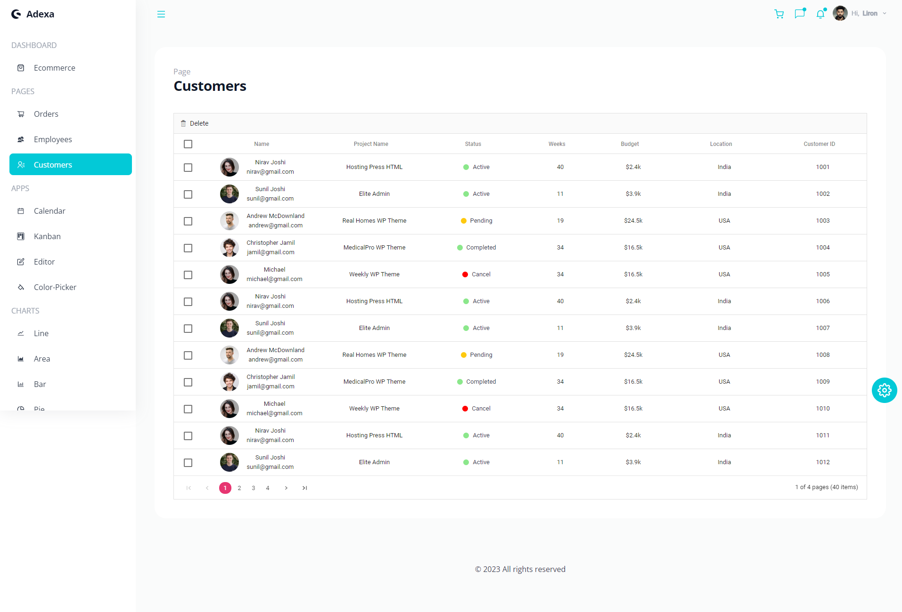
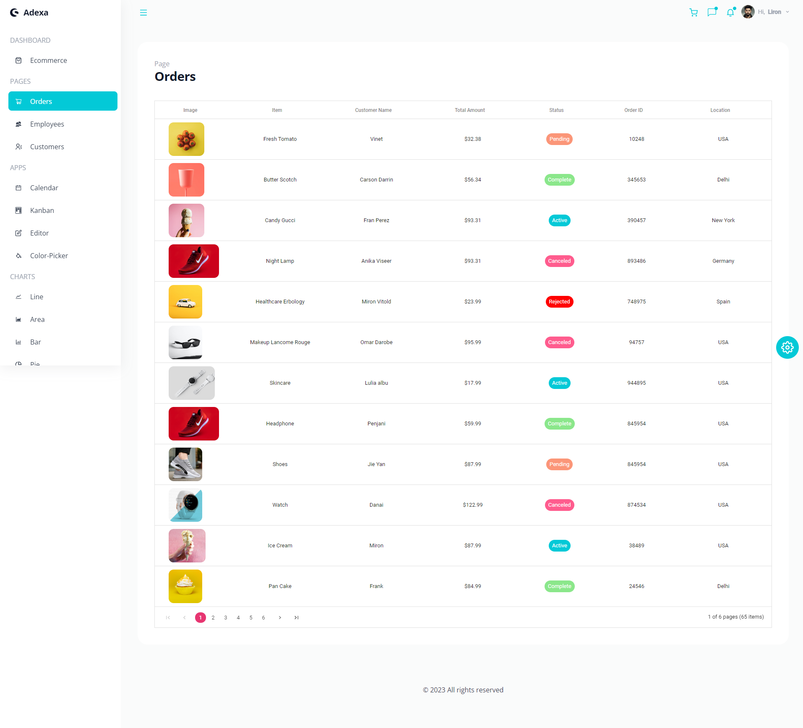

### APPS

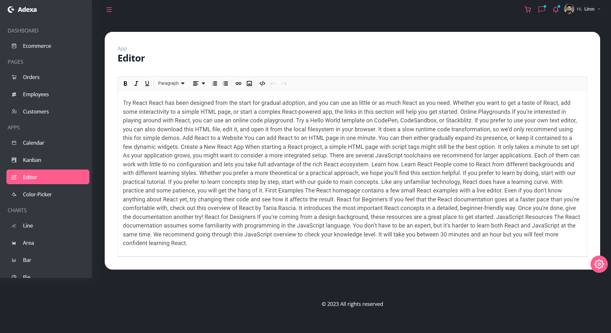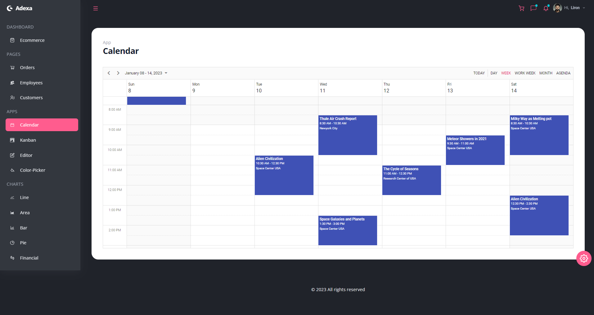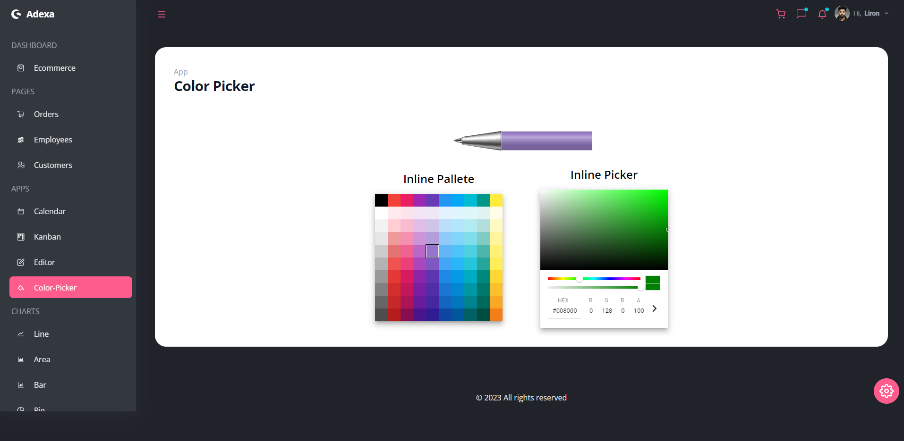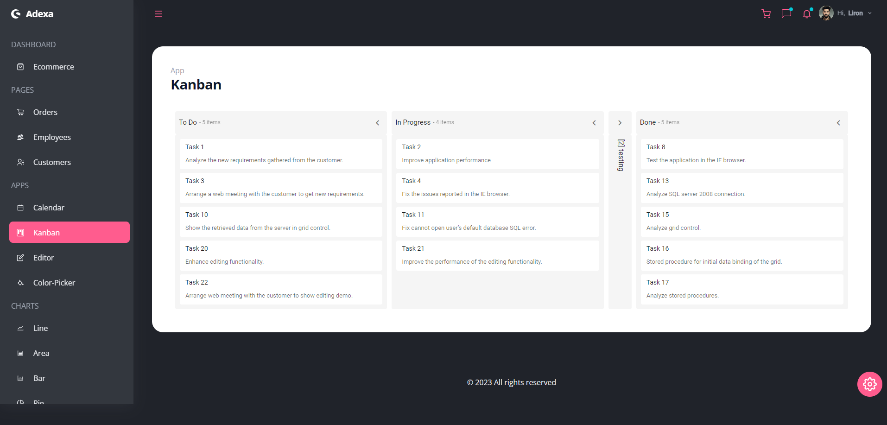

### CHARTS

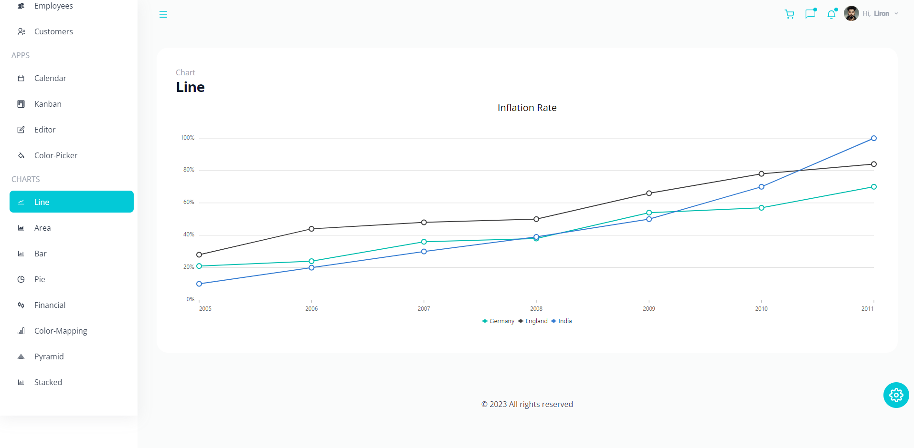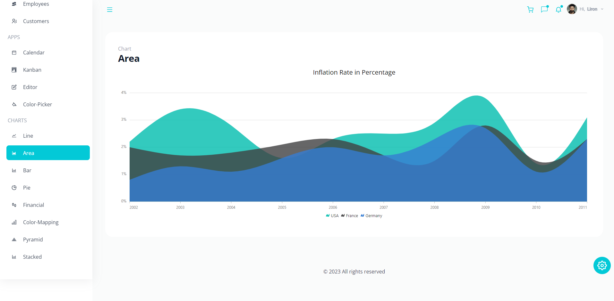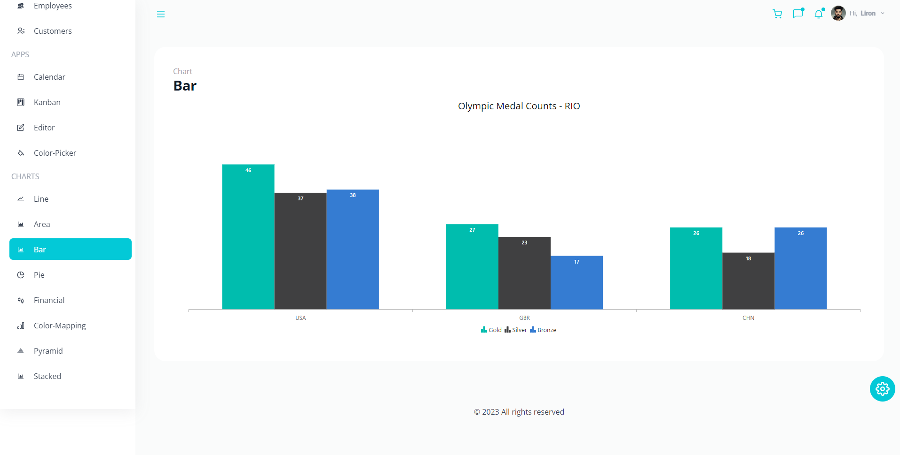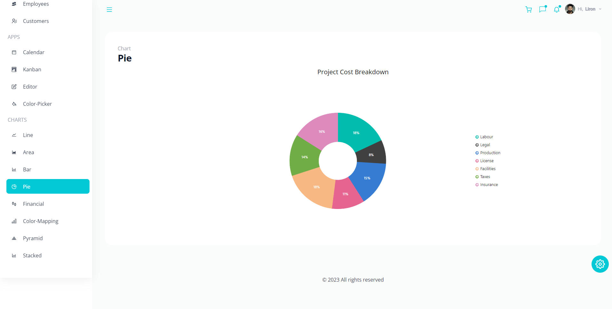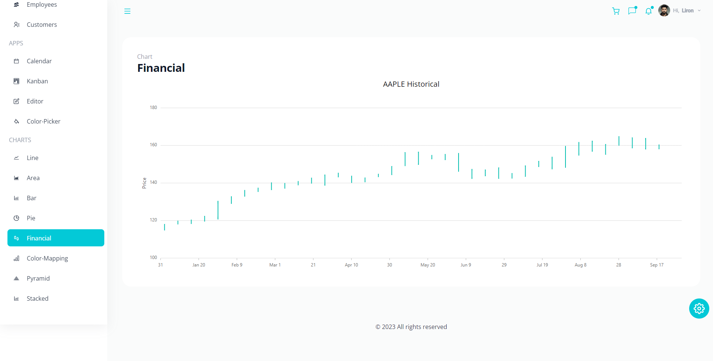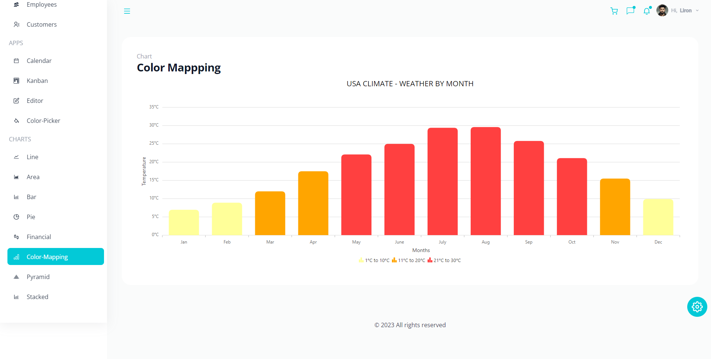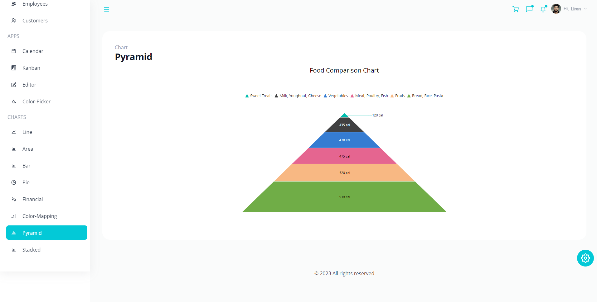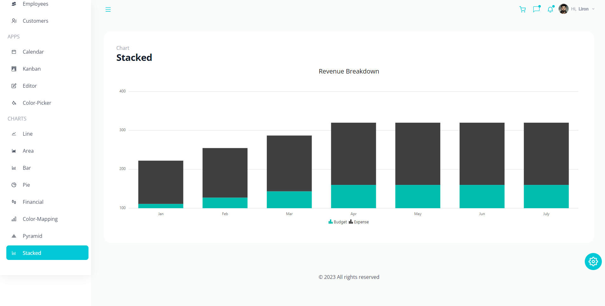


## Contribution Guidelines

We welcome contributions to enhance the Ecommerce Dashboard! If you have a feature in mind, a bug to fix, or any improvement to suggest, please follow the steps below to get started:

### Steps to Contribute

1. **Fork the Repository**: Click the "Fork" button on the top-right corner of this repository.
2. **Clone the Repository**: Clone the forked repository to your local machine.
   ```bash
   git clone https://github.com/<your-username>/Adexa-Ecommerce-Dashboard.git
   ```

   ```bash
   git checkout -b feature/your-feature-name
   ```
   ```bash
   npm start
   ```

   ```bash
   git commit -m "Add a new feature or fix a bug"
   ```

   ```bash
   git push origin feature/your-feature-name
   ```

  Open a Pull Request: Go to the original repository and create a Pull Request (PR). Provide details about the changes you've made in the PR description.

  ### Contribution Tips
  Ensure that your contribution aligns with the project goals.
  Stick to one feature or fix per pull request.
  Avoid making unnecessary changes to unrelated files.
  If adding a new feature, include relevant documentation and update the README.md if needed.


  ### Reporting Issues
  If you find any bugs or have suggestions for new features, feel free to open an issue:

  Go to the Issues section.
  Click on New Issue.
  Provide a clear title and detailed description of the issue or feature request.

<!-- Contact -->
## Contact

Linkedin - [muhammadzubairbaig](https://www.linkedin.com/in/muhammadzubairbaig/)

Project Link: [https://github.com/muhammadzubairbaig/ecommerce-dashboard](https://github.com/muhammadzubairbaig/ecommerce-dashboard)

<!-- Acknowledgments -->
## Acknowledgements

This section used to mention useful resources and libraries (packages) that used in Ecommerce Dashboard application project.
 
 - [TailwindCSS](https://tailwindcss.com/)
 - [Syncfusion](https://www.syncfusion.com/)
 - [React Router](https://reactrouter.com/en/v6.3.0/getting-started/installation)
 - [Google Fonts](https://fonts.google.com/)
